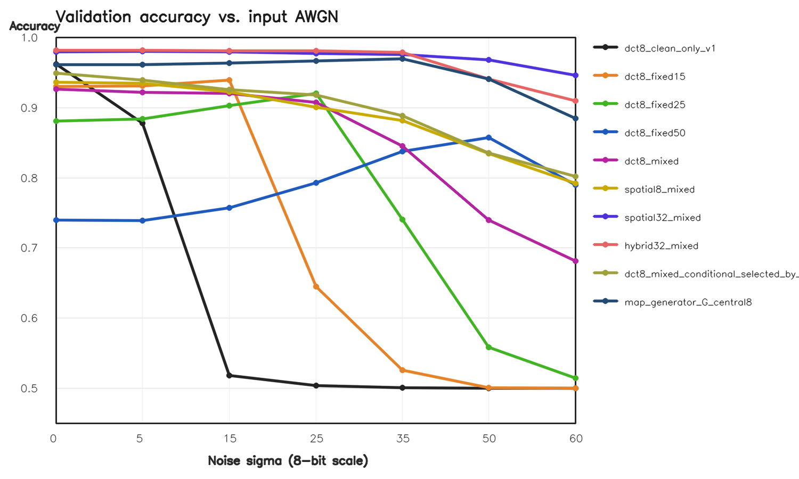
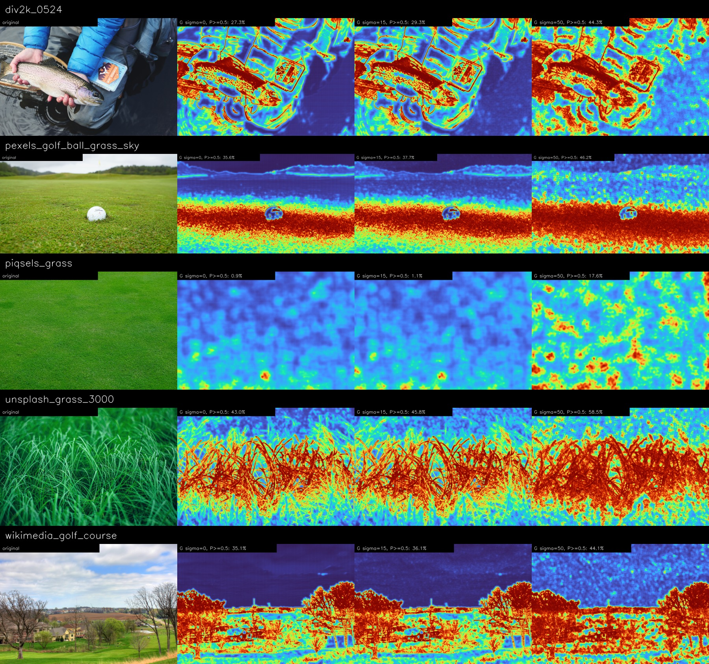
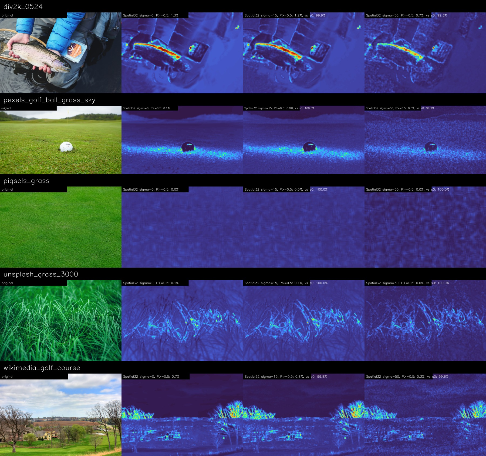

# DCT / Spatial Robust Texture Classification

An independent research reproduction and extension of the texture-map front end described in [Deep Region Adaptive Denoising for Texture Enhancement](https://doi.org/10.1109/ACCESS.2022.3222826).

This repository studies a narrow question: can a model identify image detail that should be preserved during denoising, without confusing additive noise for texture?

It includes:

- A paper-style `8x8` DCT texture/non-texture classifier.
- Fixed-noise, mixed-noise, and noise-level-conditioned DCT classifiers.
- Equal-parameter raw-spatial baselines.
- A `32x32` spatial-context classifier and a spatial/DCT hybrid.
- A dense residual U-Net-like generator `G` that maps a noisy image to a clean-teacher texture map.
- Full-resolution tiled inference without resizing.
- Checkpoints, metrics, experiment reports, and selected visual results.

> This is not the authors' official implementation. The paper leaves several classifier and generator details unspecified; all reproduction assumptions are recorded in the experiment reports.

## What the map means

The output is one soft map with values in `[0, 1]`:

- Near `1`: visible high-frequency detail / texture under the operational training definition.
- Near `0`: locally smooth or non-textured content.

It is not semantic segmentation and does not cluster pixels by material identity. A clear grass blade can score high while distant, blurred grass can score low.

## Main results

Held-out DIV2K validation patch accuracy at threshold `0.5`:

| Model | Parameters | sigma 0 | sigma 15 | sigma 50 | sigma 60 |
|---|---:|---:|---:|---:|---:|
| Clean-only DCT `8x8` | 14,113 | 96.20% | 51.80% | 50.00% | 50.00% |
| Mixed-noise DCT `8x8` | 14,113 | 92.65% | 92.05% | 73.95% | 68.10% |
| Mixed DCT + known sigma | 14,177 | 94.90% | 92.55% | 83.55% | 80.20% |
| Mixed raw spatial `8x8` | 14,113 | 93.60% | 92.25% | 83.45% | 79.20% |
| Mixed raw spatial `32x32` | 39,777 | 97.95% | 97.95% | **96.85%** | **94.60%** |
| Spatial `32x32` + DCT hybrid | 52,769 | **98.15%** | **98.10%** | 94.10% | 90.95% |



For dense maps, generator `G` reached `83.48%` binary agreement with the clean DCT teacher at sigma `50`; directly applying the clean-only DCT teacher to the noisy input reached only `58.76%` and predicted almost the whole image as texture.



The strongest patch model was also evaluated densely by tiling its central
`8x8` predictions at native resolution. It remains visually stable under
noise, but predicts only 0–1.3% of these five full images as texture at the
validation threshold `0.5`. This exposes a distribution gap between the
extreme-Sobel patch benchmark and arbitrary full-image locations; the 97% patch
accuracy must not be interpreted as dense-map accuracy.



The controlled diagnostics also expose important failures: `G` misses a synthetic 4-pixel checkerboard and over-predicts a low-contrast periodic pattern. The current model generalizes within held-out DIV2K natural images, but is not a universal texture detector.

See:

- [Paper-style v1 report](EXPERIMENT_REPORT.md)
- [Robust v2 report](EXPERIMENT_V2_REPORT.md)
- [Machine-readable v2 summary](results/robust_v2/summary.json)
- [Controlled diagnostic results](results/robust_v2/controlled_diagnostics.csv)

## Method overview

### V1: clean DCT teacher

1. Compute Sobel magnitude on each clean DIV2K image.
2. Select the highest- and lowest-detail `100x100` regions.
3. Sample balanced `8x8` texture/non-texture patches.
4. Apply an orthonormal 2-D DCT and per-coefficient training-set standardization.
5. Train a two-convolution, three-fully-connected binary classifier.
6. Produce a dense soft map by averaging every overlapping stride-1 patch prediction.

### V2: noise robustness

Patch experiments use paired data:

```text
clean patch -> pseudo-label
clean patch + AWGN -> model input
```

The full-image generator uses:

```text
noisy luminance image -> generator G -> dense texture map
clean image -> frozen DCT teacher -> training target
```

At inference time, `G` only needs the observed image. Clean images and the DCT teacher are not required.

## Installation

Python 3.10+ is recommended.

```bash
git clone https://github.com/Leo5050xvjf/DCT-Texture-Classifier.git
cd DCT-Texture-Classifier
python -m pip install -r requirements.txt
python -m unittest discover -s tests -v
```

CUDA is used automatically when available; CPU inference is supported.

## Inference with published checkpoints

Paper-style stride-1 DCT map:

```bash
python infer.py \
  --checkpoint checkpoints/paper_v1_dct_classifier.pt \
  --input-dir /path/to/images \
  --output-dir outputs/dct_maps
```

Robust dense generator `G`, preserving the original resolution:

```bash
python infer_map_generator.py \
  --checkpoint checkpoints/map_generator_g.pt \
  --input-dir /path/to/images \
  --output-dir outputs/g_maps
```

Blockwise full-image inference with the Spatial `32x32` patch classifier:

```bash
python infer_spatial32_dense.py \
  --input-dir /path/to/images \
  --sigmas 0 15 50
```

For a controlled synthetic-noise test, add `--sigma 15` or `--sigma 50`. Do not add `--sigma` to images that already contain real noise.

Each image receives:

- `texture_probability.npy`: full-precision map.
- `texture_probability_u16.png`: portable 16-bit map.
- Binary masks at thresholds `0.3`, `0.5`, and `0.7`.
- `comparison.jpg`: input, map, and overlay.

## Training from scratch

Download the DIV2K train and validation HR images separately; dataset images and generated `.npz` files are intentionally not committed.

### Train the clean DCT teacher

```bash
python build_dataset.py \
  --train-dir /path/to/DIV2K_train_HR \
  --val-dir /path/to/DIV2K_valid_HR
python train.py
```

### Train the robust patch comparisons

```bash
python build_context_dataset.py \
  --train-images /path/to/DIV2K_train_HR \
  --val-images /path/to/DIV2K_valid_HR
python train_robust_patch.py
```

### Train the dense generator

```bash
python build_map_dataset.py \
  --train-images /path/to/DIV2K_train_HR \
  --val-images /path/to/DIV2K_valid_HR
python train_map_generator.py
```

The recorded run used 6,000 balanced training patches and 2,000 independent validation patches for patch screening, plus 1,600/200 native-resolution `128x128` train/validation crops for `G`. No full image was resized during data preparation or inference.

## Optional TextureSAM integration

TextureSAM masks are not training labels. The integration utility only verifies exact shape/coordinate compatibility and computes texture statistics inside each external mask:

```bash
python score_texturesam_masks.py \
  --probability-root outputs/g_maps \
  --mask-dir /path/to/texturesam_masks \
  --output-dir outputs/texturesam_scores
```

## Repository layout

```text
dct_texture/                 Models, DCT, metrics, and dense-map utilities
tests/                       Unit tests
assets/diagnostics_inputs/   Small procedural diagnostic inputs
checkpoints/                 Published v1/v2 PyTorch checkpoints
results/paper_v1/            V1 metrics and selected figures
results/robust_v2/           Robustness metrics and selected figures
EXPERIMENT_REPORT.md         Detailed clean DCT experiment
EXPERIMENT_V2_REPORT.md      Detailed robust-model experiment
```

## Limitations

- Ground truth is an operational Sobel/DCT pseudo-label, not human material annotation.
- The main quantitative run uses one random seed.
- Robustness training currently covers clipped additive white Gaussian noise, not a complete camera ISP/noise pipeline.
- Strong out-of-distribution synthetic failures are documented in the v2 report.
- Reported performance measures reproduction of the teacher definition, not a unique or universal definition of texture.

## License

The code is released under the [MIT License](LICENSE). Dataset images remain subject to their original licenses.
